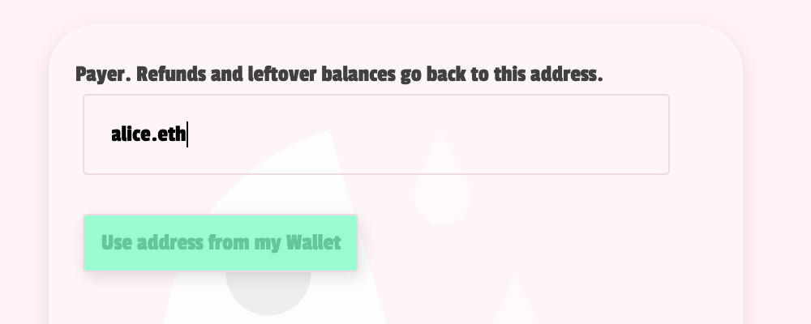
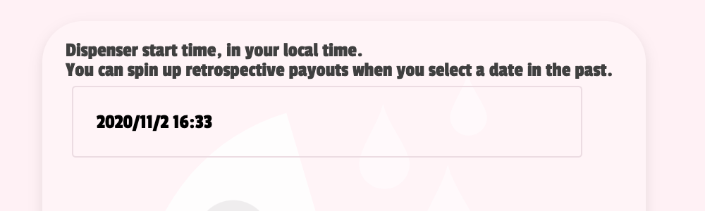
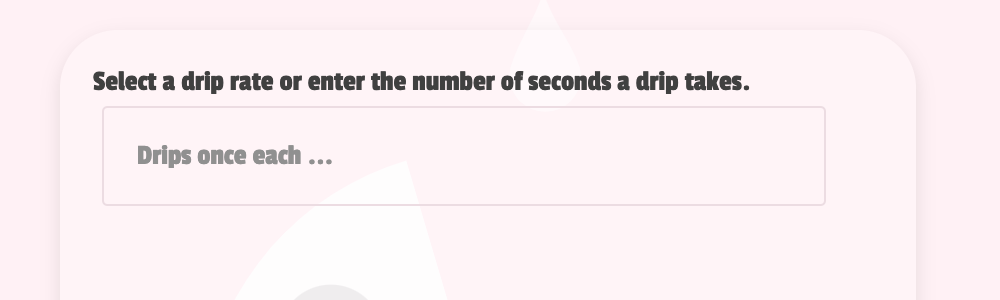
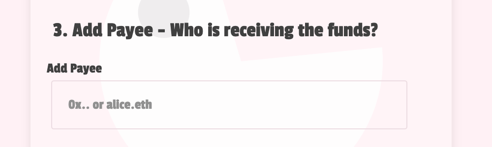
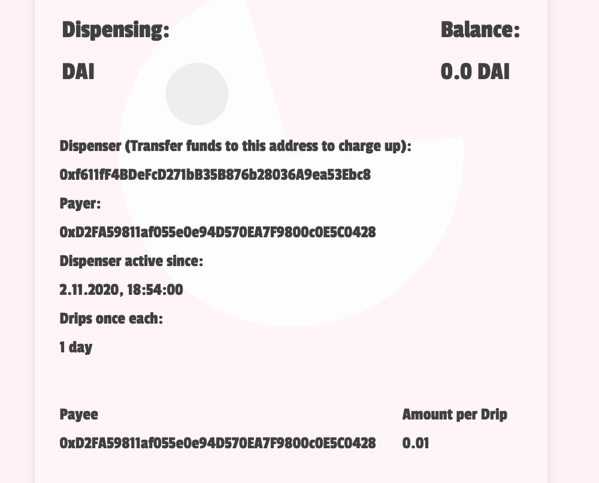
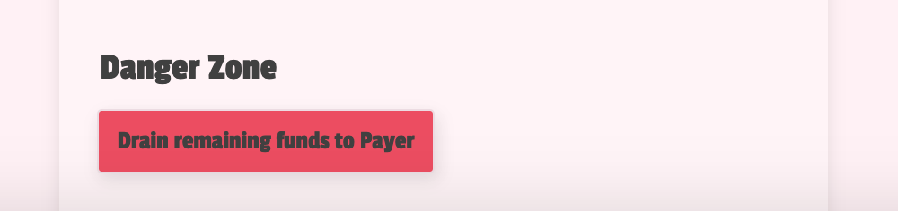

# Setup a Droplet Escrow - How it Works

##  :bulb: Before You Start

1. **We recommend to use the [Metamask Browser Wallet](https://metamask.io/)**
2. **Make sure you have some ETH on your wallet, as the Droplet contract deployment will cost some transaction fees.**

### 🥑 Ready? Let's Go!

Here is a walkthrough to get started with our droplet contract:

## Select A Token To Payout

Simply choose from a wide range of ERC-20 tokens, incl. **WETH, DAI, WBTC, etc...**

* **If you cant find your token, paste the contract address in the form.**

## Select a Payer

The Payer address initiates the contract setup and will be able to start & stop the payout process. To ensure a possible recovery of tokens, Payers receive all refunds and leftovers from the droplet contract. The Payer is typically responsible to coordinate the setup and provide funding of the contract, e.g. Project Manager coordinating humans and capital within a project.

You can also just setup the contract and use another payer address to recover funds, e.g. Company Address or a Multi-Sig Wallet.

* **Whatever the situation, the Payer/Originator is captured as a 0x address or ENS name.** 
* **Please make sure to have access to the address and wallet you choose as Payer.**

## Select a Starting Time

Next step is to decide when the droplet is starting to calculate the first wave of payout funds from the contract to the payees.

### :bulb: Pro Tip

You can also design retrospective payouts when you **select a past date**. The contract will calculate the **retrospective hours/days/weeks** and will send the respective funds to all payees included in the setup.

## Select Your Drip Rate/Interval

Once you have a starting date you need to decide how often the droplet is paying out to the payees. You can select from the following payout options: **hourly, daily & weekly**

### :exclamation: Please Note:

Based on your interval choice the contract will allocate funds to **all the** payees.

You **can not change the interval** once the contract is setup.

## Select Your Payees

Only **Payees** added by the **Payer** will receive the desired token as a payment.

**How much does the payee earn? Our Droplet contract calculates on a 24 hour basis.**

So it's fairly easy to decide on a daily drip or weekly drip payment in total numbers.

**Quick example to show you how to calculate your "drip-rate" for hourly rates:**

* Designer Alice takes 99,99 DAI per hour for her 3D graphic designer skills.
* Project Manager Bob is hiring Alice for his project and wants to use Droplet.
* Alice works 8 hours per day and charges them to Bob on a daily basis.

**Here is the math:**

*   99,99 DAI *multiplied by* 8,00 working hours = **799,92 DAI per day**
* 799,92 DAI *divided by* 24 hours = **33,33 DAI per Drip**

Bob will enter the desired amount of Alice and can include a different rate for the next expert working on the project.

So everyone get's to claim there tokens whenever they want, while Bob and the creatives can still decide and negotiate how much everyone is earning.

### :warning: Important:

All payees will be paid in the chosen interval, you can only decide on different rates per drip.

The Interface will show you a full list of payees and their respective amount per drip:

## Create Your Droplet Contract

**Once you entered all information, check all details once again and make sure to have ETH in your MetaMask Wallet, then ...**

### 🎉 Congratulations!

**You just created your first droplet contract! Just wait for the transaction to confirm :)**

## Managing Your Droplet Contract

Everyone can fund the droplet by simply sending funds to the contract address. The Droplet only pays out funds when the contract is funded with the chosen ERC-20 Token.

**Here is another DAI Example:**

### Trigger a Payout - "Drip Funds"

+ **Payees can trigger the "drip funds" option anytime.**

+ **Everyone can trigger the "drip funds" option and take over tx cost in favour of payees.**

+ **Only Payers can add Payees to the contract before the setup.**

## DANGER ZONE

**Whatever the reason for terminating the Droplet Agreement:**

* Everyone can pause the actions by submitting a tx, but only the Payer will receive all remaining funds of the contract when the Droplet is drained.

* That includes all funds within the contract, so this feature can also be used for **Recovery Purposes**.

____

#### Open Questions?

#### Feedback?

#### Submit a .md file to the /text-content folder!